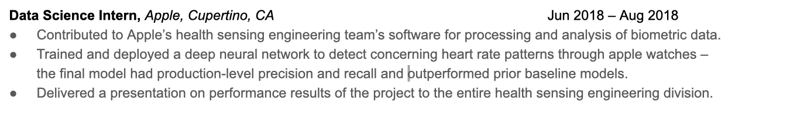
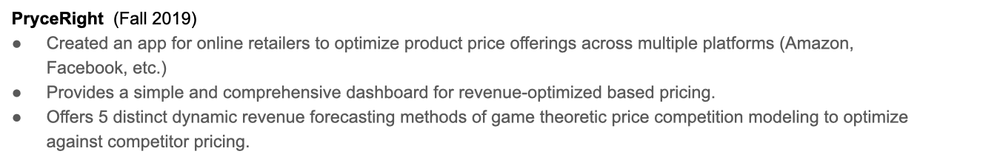

```{r setup, include=FALSE}
knitr::opts_chunk$set(echo = TRUE)
library(data.table)
library(stargazer)
library(sandwich) 
```


## Introduction

Our study examines the causal effect of having UC Berkeley’s online Master of Information and Data Science degree (MIDS) on interview callback rates for data science jobs when compared to other Berkeley graduate degrees. We also measure the effect of using numerical, as opposed to non-numerical, descriptions to depict the achievements and impacts of previous job experiences on the same outcome. To achieve this, we conduct a multi-factor experiment by responding to job postings for data-focused positions with fictitious resumes.

For each job application, we deploy two fictitious resumes tailored to appear equally competitive. We  vary the graduate degree of each application as either a MIDS degree or a master's degree in Statistics, along with the presence or absence of numerical descriptors. This assignment allows us to measure the difference in callback rates for four resulting experimental groups, each uniquely defined by degree and descripton type. The results from this study could potentially be used to inform MIDS administrators of how the program’s reputation has evolved since similar studies were conducted. Additionally, we can quantify whether failing to numerically describe achievements on one's resume is detrimental to one's interview callback rate. The researchers recognize that even though the experimental procedures were carefully deliberated, the impacts of the COVID-19 pandemic on the job market during the experimental period poses a strong threat to the external validity of the experimental results.


## Motivation

A quick web search for job announcements looking for data scientists reveals clear graduate degree preferences among employers. Listed among these degrees are the familiar and well established disciplines of Mathematics, Physics, and Statistics, along with those strongly associated with the 20th Century such as Electrical Engineering and Computer Science. Rarely do employers list a degree in Data Science among those they promote. One could hypothesize any number of possible motivations for this.

Recruiters and human resource departments often seek ways to reduce the search space among a pool of applicants. Employers seeking applicants for a data science role may be suspicious of the quality of newly established data science degrees from universities. Several articles and discussion boards online contain professional data scientists from the more traditional quantitative disciplines expressing exactly this sort of concern. In their view, the lack of a track record to judge is paired with the assumption that the training provided by these programs to early cohorts suffer from their placement on the program administrators' learning curve. This uncertainty would add an additional layer of risk to the already difficult task of identifying suitable candidates to fill data science vacancies. 

Current graduate students in data science may wonder if the preferences revealed in these online postings, and those described on job announcements, are indicative of disadvantages they may face in the data science labor market. Prospective students may even be steered toward more traditional quantitative tertiary education that is considered better preparation for a career in data science. Administrators of these programs are likely aware of the potential impacts that questions of quality have on their admissions statistics and post graduate outcomes. It is reasonable to suspect that over time the reputations of specific programs will emerge more clearly. However, the current climate may still disfavor current applicants to data science positions who possess university-granted degrees in data science.

For current and impending graduate students receiving their Master’s in Information and Data Science (MIDS) at the UC Berkeley School of Information, these concerns are of particular interest. While an expansive experiment that accounts for variation in outcomes for many different data science masters degree programs might reveal high-level trends of interest, in this study we focus on the potential outcomes for this specific group of would-be data scientists (impending and current MIDS students).

The second treatment we administered to some job applications of hypothetical candidates is a rewritten version of their resume using number-heavy descriptions to illustrate their professional impacts and relevant experiences. Our experimental design tests whether the use of numerical descriptions in lieu of nonnumerical, yet equally informative, descriptions measurably garners greater amounts of recruiters’ attention. 

The effect of the numerical descriptions factor is of interest for several reasons. It is both the common wisdom of job hunters and the advice of many universities’ career services departments, that candidates on the job market, especially recent university graduates, can make themselves more competitive by decorating their resumes with numbers which convey their impacts. For example, the Job & Internship Guide provided by UC Berkeley’s Career Center offers job seekers the following advice: “Focus on the outcomes of your efforts...Quantify your results if possible”. Our experimental design seeks to provide some scientific evidence to support this wisdom.

The numerical descriptions factor is also of interest because of explanations which researchers may promulgate if a significant result favoring numerical descriptions were found. A significant result could be explained in numerous ways. It may be the case that recruiters have an easier time noticing where the most substantial impacts on a resume are located when the resume has visually distinguished those locations using numbers. Thus, recruiters who tiredly filter through tens or hundreds of resumes everyday can scan to numerically enhanced resumes’ moments of high impact with greater ease. Another explanation might be that numerically enhanced resumes garner more respect from their readers because they activate a deep-seated reverence of math and numbers which afflicts many in our society.

In full, our motivation for including both a data-science-graduate-degree factor and a numerical-descriptions factor together in a multifactor experiment does not stop with the motivations which drive each factor individually. Understanding how the inclusion of numerical descriptions impacts callback rates within the data science industry will also be of particular interest seeing as data science is, by nature, a uniquely number-reverent industry.


## Experimental Design

Our interest in the dynamics previously described invites our first hypothesis: current resumes displaying a MIDS degree receive lower interest from employers relative to more traditional quantitative graduates of UC Berkeley. A second hypothesis would be as follows: the use of numerical descriptions in data science resumes garners higher callback rates from employers than candidates would receive otherwise.

To test these hypotheses, we design a set of fictitious resumes that are similar in every way and identify job announcements for data-centric positions.  We then send a pair of applications to each available job position, randomly varying the degree held and the use of numerical descriptors on each resume through blocked random assignment, with individual job announcements acting as blocks.

Recognizing the strong reputation of UC Berkeley’s academic programs, we sought to reduce any preference effects attached to the MIDS degree through its association with the broader campus. Additionally, we designed for a comparison between MIDS and a similarly scheduled graduate program. With these considerations in mind, we identified the Master of Arts in Statistics at UC Berkeley as the best alternate degree for comparison with MIDS. This full time program lasts roughly a year with similar credit requirements and a curriculum that includes mathematical statistics and statistical computing coursework. Additionally, both degrees are designed for industry work upon graduation, and both require students to complete a substantial, self-initiated, data-focused project in order to graduate.


## Fictitious Candidates: Reilly Adrian Smith & Skyler T Morris

Our approach calls for us to design a set of realistic yet fictitious resumes for graduate level employment opportunities in the data science industry. To do this, we engendered two fictitious candidates on the job market, and we took special care to ensure that the candidates were as close to equally competitive as possible in the way of their academic records and professional experiences. Additionally, both fictional candidates  were made out to have gone through a four year undergraduate program in Applied Math and Statistics at UC Berkeley and directly into a graduate level program at the same university.

When choosing the two full names to headline the fictitious resumes, we had them meet several criteria to simplify our experiment and increase the overall likelihood of callback. Each of the two names had to meet the following conditions:

* The name is a common Anglo name.
* The name is gender neutral.
* Several pages of LinkedIn profiles have this name.

Anglo in origin is a criterion because resume audits have already been conducted which measure the effects of race signals on application outcomes. Many of them unfortunately find significant negative effects disfavoring names of African American and Latin origin. As such, we choose anlgo names to boost the candidate’s potential outcomes. We required the names to be gender neutral so that the downstream experimental results are more likely to generalize to any gender. 

Finally, to validate that each name is sufficiently common, gender neutral and primarily used by people of caucasian descent, we searched each name on LinkedIn and checked the number of pages of people using the name along with the gender and race distributions associated with them. The first full names to meet these conditions were Reilly Smith and Skyler Morris.


## Fictitious Resume Content

Each resume has a section titled “Experience” and a section titled “Projects”. It was in these sections that we fabricated and inserted fictional experiences comparable to those of a talented statistics or data science graduate student. Experiences were made up of industry internships, university research roles and TA positions for technical classes on campus. An example of item in the "Experiences" section is below:



While an example of a item listed under “Projects” is the following:



To examine the exhaustive content in both experimental resumes, please see the appendix.


## Treatment Design

We took special care in designing both the MIDS degree treatment and the numerical description treatment so that an exclusion restriction assumption about both of these factors would hold. For the degree treatment this design was straight forward. Consider the following two different degree signatures which we put on resumes assigned the master’s degrees in statistics or master's degree in data science, respectively:


For the excludability assumption to hold, any causal effect of the second signature relative to the first occurs only through the pathway of the degree “Information and Data Science” as opposed to the school of study, the “School of Information”. We are confident that this is a reasonable assumption because the College of Letters and Science and the School of Information at UC Berkeley are equally prestigious, and the university name, as opposed to the school, is printed in bold on both degree signatures.	

On the other hand, it was challenging to design numerical and nonnumerical descriptions of each experience such that both descriptions convey exactly the same information. Consider the following table of examples:


|Non-Numerical Description|Numerical Description|
|------------------------|------------------------|
|The final model had production-level precision and recall and outperformed prior baseline models.|The final model had 88% precision and 87% recall and outperformed prior baseline models.|The final model had 88% precision and 87% recall and outperformed prior baseline models.|
|||
|Ideated an estimation method which substantially improved the reliability of estimators’ credible intervals.|Ideated an estimation method which substantially improved the reliability of estimators’ 95% credible intervals.|
|||
|Conducted a user study in which the great majority of subjects reported being completely satisfied with the product.|Conducted a user study in which 10 of 12 subjects reported being completely satisfied with the product.|
|||
|Bachelor of Arts, Applied Mathematics and Statistics, Double Major (High Distinction)|Bachelor of Arts, Applied Mathematics and Statistics, Double Major (GPA 3.87)|
|||
|Model harnesses a two-way data flow process, allowing for the update and improvement of network based on presented images.|Model harnesses a 2-way data flow process, allowing for the update and improvement of network based on presented images.|


For the excludability assumption about the numerical descriptions factor to hold, We must assume that a numerical description of item $x$ contains the same substantive information as the non numerical description of item $x$. Let $I_n(x)$ denote the amount of information contained in a numerical description of $x$, while $I_e(x)$ denotes the information contained in an alternative english (nonnumerical) description. 

We did our best to have $I_n(x) = I_e(x)$ but note that it is okay if $I_e(x) > I_n(x)$ because our alternative hypothesis about this factor is one-sided. If it were the case that $I_e(x) > I_n(x)$ and we able to reject the null hypothesis and conclude that $\mathbb{E}[Y_i(I_n(x))] > \mathbb{E}[Y_i(I_e(x))]$, then it would follow that $\mathbb{E}[Y_i(I_n(x))] > \mathbb{E}[Y_i(I_e(x))]$ when $I_e(x) = I_n(x)$ assuming that call back rate as a function of the amount of impressive information on a resume is monotonically increasing. Our strategies for maintaining $I_n(x) \geq I_e(x)$ include the following: 


1. Using english words which convey a magnitude of impact at least as impressive as the impact conveyed with the numerically specified quantity. E.g, “great majority” as a counterpart to “10 of 12.” 
1. Relying on well known defaults, such as the 95% benchmark as a standard confidence level. In one item, we exploit this exact default by referring to an estimator’s “credible interval” in the nonnumerical description, and referring to it’s “95% credible interval” in the numerical counterpart.
1. Using the english spelling of a quantity as opposed to conveying the quantity with a number: “two-way data flow process” vs “2-way data flow process”.

While we attempted to maintain and hereby assume that for any item $x$, $I_n(x) \geq I_e(x)$, the fact still remains that that a numerical description contains more specificity, and may therefore threaten the excludability assumption. If recruiters favor numerical descriptions more, they may do so because of an applicant’s ability to be specific (or simply recall their exact accomplishment). Although this threat to the excludability assumption lingers, according to our best judgement, it is small, so we proceed under the excludability assumption.


## Treatment Assignment

In the experiment, we submitted 122 job applications for 61 different open data science positions at 61 different companies in the Bay Area. For each open position, we submit two applications, the first of which is always by Reilly Smith, and the second of which is by Skyler Morris. One of them is randomly assigned the master’s degree in statistics, while the other is assigned the data science master's degree. Similarly, one of them is randomly assigned the version of their resume containing numerical descriptions, while the other applies using the nonnumerical version of their resume. In other words, both treatments are independently blocked on the companies we apply to. Thus, if Reilly and Skyler were to apply to a job at Yahoo!, for example, there are 4 possible treatment assignment permutations between them:

|Company|Applicant|MIDS|Numerical|
|-|-|-|-|
|Yahoo!|Reilly Smith|0|0|
|Yahoo!|Skyler Morris|1|1|
|||||
|Yahoo!|Reilly Smith|1|0|
|Yahoo!|Skyler Morris|0|1|
|||||
|Yahoo!|Reilly Smith|0|1|
|Yahoo!|Skyler Morris|1|0|
|||||
|Yahoo!|Reilly Smith|1|1|
|Yahoo!|Skyler Morris|0|0|


We plan to use linear regression to identify the causal effects of both the MIDS degree treatment and the numerical description treatment on interview callback rates. This requires that we assume non-interference between applications, which can conceivably not hold when two applications are sent to the same company. For example, recruiters might have a cutoff that ends at Reilly’s application, or Reilly Smith’s application could conceivably impress a recruiter so much that the recruiter then views Skyer Morris’s application less favorably than they would have if they had seen Skyler’s first. We are comfortable proceeding with the non-interference assumption nonetheless because the resumes were designed to be equally competitive across a broad range of data science job types. In addition, data science roles in the Bay area receive tremendous volumes of applicants (usually in the hundreds), and we doubt that seasoned recruiters would be influenced so greatly by a single new graduate's resume in the flow of their resume sifting.

Lastly, the blocked random assignment of treatments was done using the pseudo-random number generation facility in R and was done so with a seed so that it may be reproduced. The random assignment was prespecified using up to 1000 applications before the deployment of applications. 


## Determining Sample Size

According to a power calculation, we decided to send at least 109 applications (and eventually sent 122). To make this calculation, we had to speculate about the application callback rate for applications with nonnumerical resumes and the true average treatment effect of the numerical descriptions factor. These speculations are based on the personal experience of one of the researchers when talking to a data scientist at Esurance. When offering advice about how to get more attention from recruiters, he claimed that adding numbers to his resume made a significant difference in his job hunt, raising his callback rate from 5% to 25%. Respecting the possibility that he was exaggerating in the moment, we proceeded to estimate that resumes without numerical descriptions have a 5% callback rate, while resumes enhanced with numerical descriptions have a 15% callback rate. In order to have 80% power, we then calculated the necessary sample size of 109 under these speculated estimates. The details of the power calculations can be found in the Appendix.


## Application Deployment
 
To identify potential job announcements for our experimental blocks, we primarily used the popular job search engines Indeed, Glassdoor, and Google Jobs. While Indeed acts as its own job posting site, Google Jobs aggregates job announcements from other job boards. This resulted in applications going through a multitude of portals, but the lion’s share went through the Indeed and Glassdoor sites.

Suitable job announcements were identified within a set of criteria. For location, we searched for open positions advertised in the following nine counties:

||||
|-|-|-|
|Alameda|Napa|Santa Clara|
|Contra Costa|San Francisco|Solano|
|Marin|San Mateo|Sonoma|

These counties all fall within a reasonable distance from the University of California, Berkeley campus. As such, they are more likely to be familiar with the university and the graduates they produce. It should be noted that while the MIDS program is fashioned as a remote program capable of delivering their education to an international student body, our desire to compare MIDS to other Berkeley STEM graduates pushes us to consider proximity. Additionally, many of these counties have a high density of firms looking to hire data professionals relative to counties in other parts of California, as well as other states.

Additionally, we sought job announcements with similar credentialing and professional experience requirements. With our fictional candidates having gone straight through undergraduate education to a graduate program, we collected applications to job listings that sought individuals at the entry level, or with less than four years of experience.

During the submission process, we encountered some instances in which employers required applicants to submit cover letters and LinkedIn profiles. To maintain the anonymity of our experiment and maximize the number of applications submitted, we formulated generic cover letters, and a statement explaining our displeasure with LinkedIn’s user data practices. The templates are displayed in the Appendix.


## Data Collection

Our analysis required us to collect employer callbacks for each of the 4 treatment groups with content from 2 resumes. This gave us 8 resumes in which to monitor and collect indications of employer interest. To streamline this process, we generated 8 GMail accounts in which to collect any responses from interested employers. Additionally, we used 4 Google Voice phone numbers attached to each of the four experimental groups, with the intention of scanning voicemails left for our candidates and distinguishing between application responses using the fake resume names mentioned.

The recording of employer responses came primarily from emails expressing interest in our fictional job candidates, with a handful coming into our Google Voice inboxes. For each email response received, we use the content of the message left by the employer to match the response to the corresponding resume. This process was made highly efficient by allocating each resume variant its own designated email, allowing for a simple identification of firm and position applied to for recording callbacks.

When considering the types of responses our fictional applicants might receive, we decided to collect two types of callbacks. First, any response expressing interest would be considered a positive callback, coded as $1$, with responses of disinterest, or no contact at all, resulting in a negative response, coded as $0$. The second type of response we collected is specific to technical workers: a request to complete a small project as part of the application process.


## Attrition

Requests for completion of a take-home project to move forward with the interview process presents a challenge to our identification strategy. It is unclear whether requests of this sort by employers are an indication of interest in a candidate, or instead take-home projects are used merely to thin the pool of qualified applicants by being distributed to all who’ve applied. This is of special concern if the projects are designed for automated evaluation. With these concerns in mind, we decided to collect an additional outcome variable for a positive callback being a project request.

Our study showed signs that requests for projects were automatically generated for each applicant, circumventing the evaluation process needed to determine the outcome of the subject had their resume been evaluated and their treatment conditions exposed. We therefore conclude that requests for projects should be treated as attrition.

Given the evidence that projects would be automatically generated for the pair of resumes sent to an employer, we can assume that propensity to attrite is independent of treatment assignment. However, systematic differences between firms that request projects and those that don’t may be correlated with potential outcomes. For instance, technology firms may be more likely to request projects relative to those in the healthcare sector. It may also be that tech firms tend to prefer more traditional graduate programs over new ones such as MIDS. We then cannot say that attrition is independent of potential outcomes.


## Pre-Treatment Covariates and Heterogeneous Treatment Effects

We considered possible heterogeneous treatment effects on some characteristics of job announcements. These covariates were collected during the application deployment process. 


**_Covariates of Interest_**:

* *Skyler Morris* (SM)

> An indicator representing whether the applicant was Skyler Morris and the resume contained her associated set of professional experiences (as opposed to Reilly Smith and their experiences). While we designed the candidates' base resumes to be equally competitive in the way of their academic records and professional experiences, it may be the case that one of the base resumes is actually more competitive, in which case it is important to control for which candidate applied in a submitted application.

* *Minimum Degree Required* (M)

> The minimum degree required per job application varied mostly between Bachelor’s and Master’s degrees, with one job posting expressing a preference that applicants hold a PhD. This requirement may reveal the employer’s preference, as those that require a graduate degree at a minimum, may be more inclined to hire statisticians, as opposed to individuals holding a Master’s degree in data science with less mathematical exposure.

* *Type of Role* (analyst or scientist) (R)

> Consider the interaction coefficient between the type of role and the type of degree assigned per submitted application. An applicant with a Master’s in Statistics could potentially be a better candidate for the position of a “scientist”, as opposed to an applicant with a MIDS degree, who, from the perspective of a recruiter, may only be considered a competitive candidate for a position as an analyst.

* *Number of Days Posted* (DP) & *Date of Submission* (DS) 

> We considered the days passed since the job listing was posted and the day of application submission as measurements of time. The number of days since the job posting relative to the date of submission may affect the callback rates because the longer time goes on since the posting of a job, the more likely the position is to have already been filled. Additionaly, the exact date of application may also be relevant to applications' potential outcomes. For example, an application that was submitted on a day when the outbreak of COVID-19 became more severe, may have lower potential outcomes than an application that was submitted in days prior when the outbreak was less severe. 

We represent the set of covariates in vector form $C_i$:

$$C_i = (SM, M, R, DP, DS)^T $$


## Covariate Balance Check

As a check for covariate balance between experimental treatments, we regress reception of the graduate degree treatment and reception of the numerical decription treatment on $C_i$. None of the covariates are significantly correlated with either treatment indicator. As such, the covariate balance check passes with flying colors. For the covariate balance check regression table, please the Appendix.

## Identification Strategy

Our experiment employs a factorial 2x2 design with two factors: degree and descriptor. A straightforward identification strategy is to implement a difference estimator for each factor. We thus estimate a model of the following linear form:

$$Y_{ik} = \beta_0 + M_i\beta_1 + Q_i\beta_2 + M_iQ_i\beta_3 + M_iS_i\beta_4 + M_iE_i\beta_5 + \gamma  C_i + u_i$$

where $M_i$ and $Q_i$ are the MIDS and numerical-descriptor treatment indicators for application $i$ sent to job announcement $k$. $S_i$ and $E_i$ are indicators for the job role designating scientist and engineer respectively, with analyst as the omitted group. The vector $C_i$ contains all pre-treatment covariates and $u_i$ is the idiosyncratic error.

## Responses

Out of 122 applications sent out, we received 8 total responses, 4 of which were requests for projects. Below is a table showing the responses gathered, dropping those who attrite, concluding the trial period of March 11th - April 9th. 

||Numerical|Non-Numerical|
|:-|:-:|:-:|
|MIDS|1|1|
|Stats|1|1

As we can see, the four responses are distributed in such a way as to provide our study with zero evidence to challenge our null hypotheses. As a result of this distribution and the high proportion of attrition, any regression table would fail to provide any additional information to our writeup (though one has been provided in the Appendix).

## A Note on COVID-19

Our trial period began March 10th of 2020. Seven days later on March 17th, the nine counties in the Bay Area issued a shelter at home order in response to the COVID-19 pandemic taking hold in the United States. We received some feedback which suggested that this exogenous factor greatly impaired our ability to collect generalizable observations for our subjects. We received the following correspondence from one positive callback:

> *"Hi Skyler,*

> *Thank you for your time spent with us for the Data Scientist role. At this time, we have decided to place this position on hold, and therefore need to cancel our scheduled phone interview. When the role re-opens, we will be sure to contact you.
We apologize for any inconvenience this has caused.”*

This response demonstrates how the shelter in place order impacted hiring and employment across the region. Later in the month, new unemployment claims soared as millions of Californians lost their jobs due to business uncertainty surrounding the pandemic. While many of these jobs come from the service sector, there is anecdotal evidence that firms hiring data scientists were also shedding workers, suggesting that these sectors may have been undergoing a hiring freeze at the least. In order to gain confidence in any conclusions drawn from our experimental design, a followup study should be conducted.

## Conclusion

In this study, we attempted to examine the effects of holding a Masters in Information and Data Science when compared to more traditional graduate programs, here as a Masters in Statistics, as well as the detrimental impact of failing to convey the impacts of previous work experiences using numbers. We designed a set of fictitious resumes of comparable quality in academic and work experience, varying the degree type and descriptors used. We sent out 122 applications to 61 job announcements to measure the callback rate differences between our experimental groups.

Unfortunately, despite the measures we took to design a sound experiment and execute it gracefully and cautiously, the variation in the response variable, a callback from an employer, suffered from incredibly low variation, with only 8 out of 122 applications receiving callbacks, and 4 of those attriting. Moreover, the 4 postive responses to our applications are perfectly balanced across experimental groups, thus offering zero insights into the profile of a competitive data scientist on the job market. However, there is also strong evidence to suggest that the onset of the COVID-19 pandemic impacted companies' propensities to hire new data scientists during the experimental period. As such, we reason that the disappointingly uninformative results of this trail are unlikely to generalize to a more stable state of the globe. Once such a state has been reached, the researchers intend to conduct a follow-up experiment.


\newpage

## APPENDIX


**_Experimental Design in ROXO Grammar_**:

|Degree + Description Assignment||||
|-----|-----|-----|-----|
|MIDS + Numerical|R|$X_{11}$|O|
|MIDS + Non-Numerical|R|$X_{12}$|O|
|STAT + Numerical|R|$X_{21}$|O|
|STAT + Non-Numerical|R|$X_{22}$|O|

**_Power Forecast_**:

Let
\begin{align*}
\bar{X} &= \text{ be the positive response rate for the treatment group} \\
\bar{Y} &= \text{ be the positive response rate for the control group} \\
\end{align*}
Then 
$$\hat{\tau} = \bar{X} - \bar{Y}$$
Assuming a one-sided test (which is the case for the numerical descriptions treatment), the power calculation is:
$$ power 
= P \Big[ \frac{\hat{\tau}}{\sigma_{\hat{\tau}}} > z(\alpha) \Big]
= P \Big[ \frac{\hat{\tau} - \tau}{\sigma_{\hat{\tau}}} > z(\alpha) -\tau / \sigma_{\hat{\tau}}  \Big]\\$$

If $n$ is the number of subjects,
$$\sigma_{\hat{\tau}}^2 = \frac{\sigma_{X}^2 + \sigma_{Y}^2}{n}$$

Therefore, the necessary sample size $n$ as a function of desired power, and true ATE, $\tau$ is:
$$n = \frac{\big[z(\alpha) - \Phi^{-1}(1-power)\big]^2 \times (\sigma_{X}^2 + \sigma_{Y}^2)}{\tau^2}$$

Plugging in $power = 0.8, \space \alpha = 0.05, \space \bar{X} = 0.05 \space \text{ and } \space \bar{Y} = 0.15$, the derivation above yields $n$ = 109. As such we submitted at least this number of applications (122).

\vspace{10pt}

**_Ficitional Applicant Information_**:

Below we display a table of the fictitious applicants with their corresponding email addresses, phone numbers along with their treatment group designation.


|Treatment Group|Stats, Non-Num.|MIDS, Non-Num.|Stats, Num.|MIDS, Num.|
|-|-|-|-|-|
|Treat Tag|Name Resume|Name, Resume|Name - Resume|Name | Resume|
|Phone| \*\*\*-\*\*\*-4787|\*\*\*-\*\*\*-6356|\*\*\*-\*\*\*-2827|\*\*\*-\*\*\*-0539|
Skyler|skyler.\*\*.morris\@\*|skyler.\*\*.morris\@\*|skyler.\*\*.morris\@\*|skyler.\*\*.morris\@\*|
|Reilly|reilly\*\*smith\@\*|reilly\*\*smith\@\*|reilly\*\*smith\@\*m|reillyd\*\*smith\@\*|

\vspace{10pt}

**_LinkedIn Responses_**:

Reilly’s:

*I refuse to use linkedin out of data privacy concerns, and I am happy to discuss why in later stages. Thank you for understanding.*

Skyler’s:

*Linkedin has data handling practices which concern me deeply because they compromise user privacy. If you would like to discuss this further, please don’t hesitate to reach out to me.*

**_Cover letters_**:

Reilly’s:

*Hi, my name is Reilly Smith, and I have acquired a broad range of data science experience through my coursework at UC Berkeley, academic research and industry internships. I believe that I am a great fit for <company name> because I like its unique mission and I have the qualifications necessary to succeed on a fast-paced data science team. I look forward to the opportunity to work with you.*

Skyler’s:

*I enjoy all branches of data science from machine learning to analytics to data engineering. Combined, my data science qualifications, interest in the <industry name> industry and desire to work at a forward thinking company make me a great fit for a role as a data scientist at <company name>. *

\newpage

**Covariance Balance Check**


\newpage

**Regression Table**


